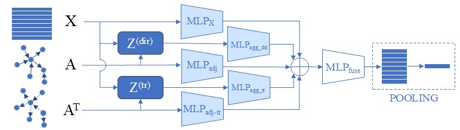

# **Does Directionality Matter? Granger Causality Meets Graph Neural Networks for fMRI-based Mental Disorder Diagnosis**

[[Paper]](https://ieeexplore.ieee.org/abstract/document/11464867/) [[Supplementary]](ICASSP_supplementary_materials.pdf)

## Overview

Our work investigates how directionality in brain functional networks influences graph neural network performance for fMRI-based mental disorder diagnosis.
We propose a directed graph learning framework that integrates Granger causality estimation with graph convolution, enabling more accurate modeling of brain connectivity.
At the same time, we further introduce an efficient model that maintains the advantages of direction-aware graph representations while improving computational efficiency.

This repo now provides a demo implementation of our proposed method EDGNN for directed graph learning based on Granger causality.
Detailed experimental results are presented in the [supplementary material](ICASSP_supplementary_materials.pdf).

<p align="center">
  
</p>

Due to permission reasons, we cannot open source the patient's original BOLD signal. This demo uses the ABIDE dataset pre-processed by the JNGC method, which contains 1090 samples for training.

---

## Repository Structure

```
EDGNN/
├── demo_EDGNN.py              # Main training & evaluation script for EDGNN
├── demo_preprocess.py         # Preprocessing demo: 4 connectivity methods on synthetic fMRI
├── environment.yml            # Conda environment specification
├── utils/
│   └── jacob.py               # JRNGC model: training, Jacobian inference, binarization
├── data/
│   ├── jacob_dataset.pt.gz    # Pre-processed ABIDE dataset (JNGC method, 1090 samples)
│   ├── read_dataset.py        # Dataset loader (supports .pt.gz and folders of .npz)
│   └── architect.jpg          # Model architecture figure
└── ICASSP_supplementary_materials.pdf
```

> **Note on `utils/`:** `utils/jacob.py` is required only by the JNGC method in `demo_preprocess.py`. Without it the JNGC step is skipped gracefully; all other methods (Pearson, VAR, KGC) and `demo_EDGNN.py` run without it.

> **Note on data:** Due to data-sharing restrictions, raw BOLD signals are not released. The included `data/jacob_dataset.pt.gz` contains the ABIDE dataset pre-processed with the Jacobian Neural Granger Causality (JNGC) method (1090 samples, AAL-116 parcellation).

---

## Environment Setup

### Option 1 — Conda (recommended)

```bash
conda env create -f environment.yml
conda activate brain
```

### Option 2 — pip (core dependencies)

```bash
pip install torch torchvision torchaudio --index-url https://download.pytorch.org/whl/cu128
pip install torch-geometric
pip install numpy scipy scikit-learn statsmodels matplotlib tqdm
# Optional: required for Kernel GC (KGC) method
pip install mlcausality
```

**Requirements summary:**

- Python 3.10
- PyTorch ≥ 2.7 (CUDA 12.8 recommended; CPU also works)
- torch-geometric ≥ 2.6
- statsmodels, scikit-learn, numpy, scipy, matplotlib, tqdm
- `mlcausality` *(optional, only needed for KGC in the preprocessing demo)*

---

## Running the Code

### 1. Preprocessing Demo

Demonstrates all four connectivity-graph construction methods on synthetic fMRI data (N=116 ROIs, T=200 time points, VAR(2) process with known ground-truth edges). No real data required.

```bash
python demo_preprocess.py
```

Output saved to `demo_output/`:

- `adjacency_comparison.png` — heatmap grid comparing all four methods vs. ground truth
- `sample_pearson.npz`, `sample_var_gc.npz`, `sample_kgc.npz`, `sample_jngc.npz` — adjacency data in `.npz` format

> KGC and JNGC require `mlcausality` and `torch` respectively; they are skipped gracefully if not installed.

---

### 2. EDGNN Training & Evaluation

Train and evaluate EDGNN on the included ABIDE dataset (JNGC pre-processed graphs) using 5-fold cross-validation averaged over 5 random seeds:

```bash
python demo_EDGNN.py
```

**Example with custom arguments:**

```bash
python demo_EDGNN.py --epochs 200 --lr 5e-4 --batch_size 32
```

Results are written to `results/<exp_name>/`:

- `run_seed{i}.txt` — per-fold metrics for each seed
- `final_summary.txt` — mean ± std of Accuracy, Precision, Recall, F1, AUC across all 25 runs

**To use your own pre-processed graphs**, pass a folder of `.npz` files where each file contains:

```
edge_index  : shape [2, E],  dtype int64    # directed edge list
edge_attr   : shape [E],     dtype float32  # edge weights
roi         : shape [N, N],  dtype float32  # Pearson correlation matrix (node features)
label       : shape [1],     dtype int64    # 0 = healthy control, 1 = patient
sample_id   : shape [1],     dtype int64    # subject identifier
```

```bash
python demo_EDGNN.py --folder path/to/your/npz_folder
```

---

## Citation

If you find this work useful, please cite:

```bibtex
@INPROCEEDINGS{11464867,
  author={Liu, Zonghuan and Yu, Shujian},
  booktitle={ICASSP 2026 - 2026 IEEE International Conference on Acoustics, Speech and Signal Processing (ICASSP)}, 
  title={Does Directionality Matter? Granger Causality Meets Graph Neural Networks for FMRI-based Mental Disorder Diagnosis}, 
  year={2026},
  volume={},
  number={},
  pages={8147-8151},
  keywords={Filtering;Filters;Circuits and systems;Circuits;Spread spectrum communication;Protocols;Information and communication technology;HTTP;Ambient assisted living;Radio access networks;fMRI;brain network classification;Granger causality;directed graph neural networks},
  doi={10.1109/ICASSP55912.2026.11464867}}

```
